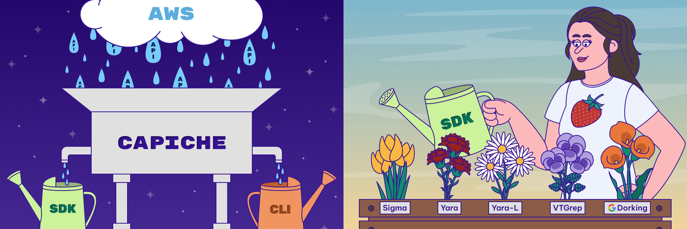
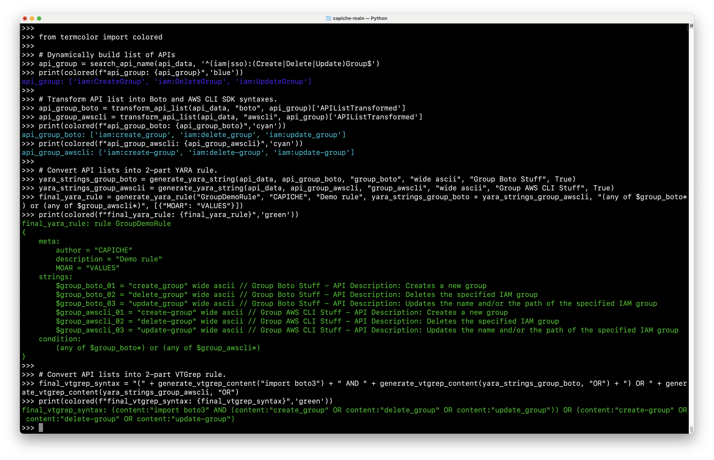
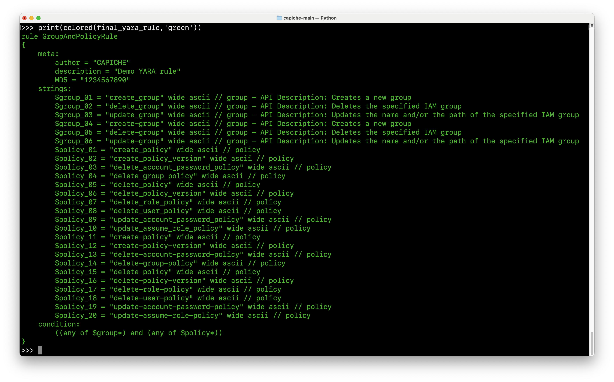
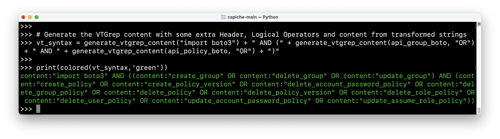
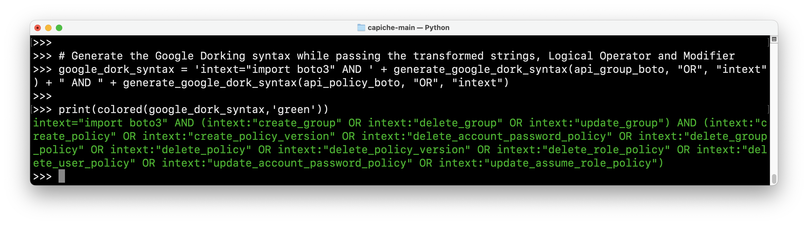
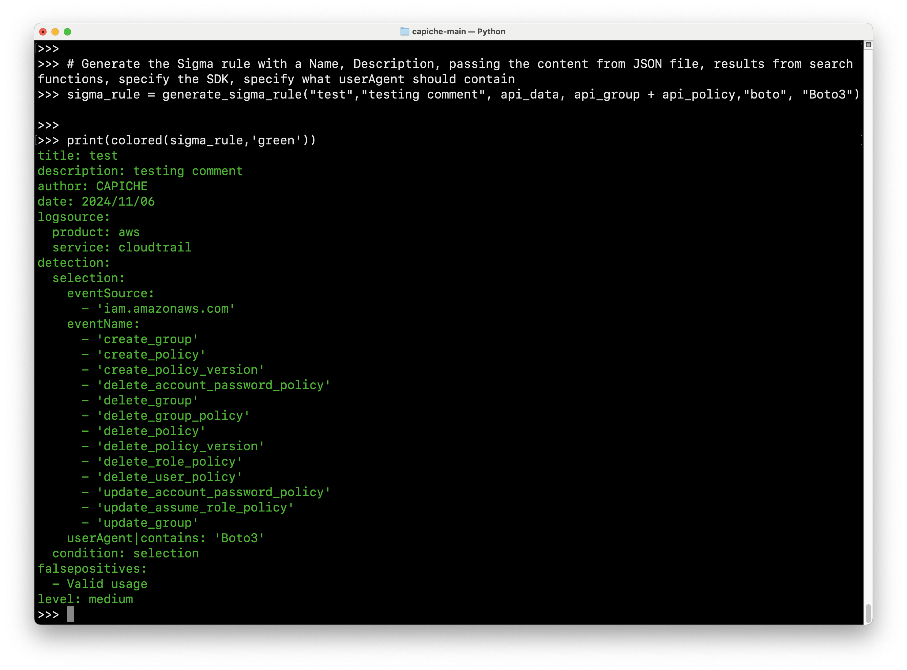
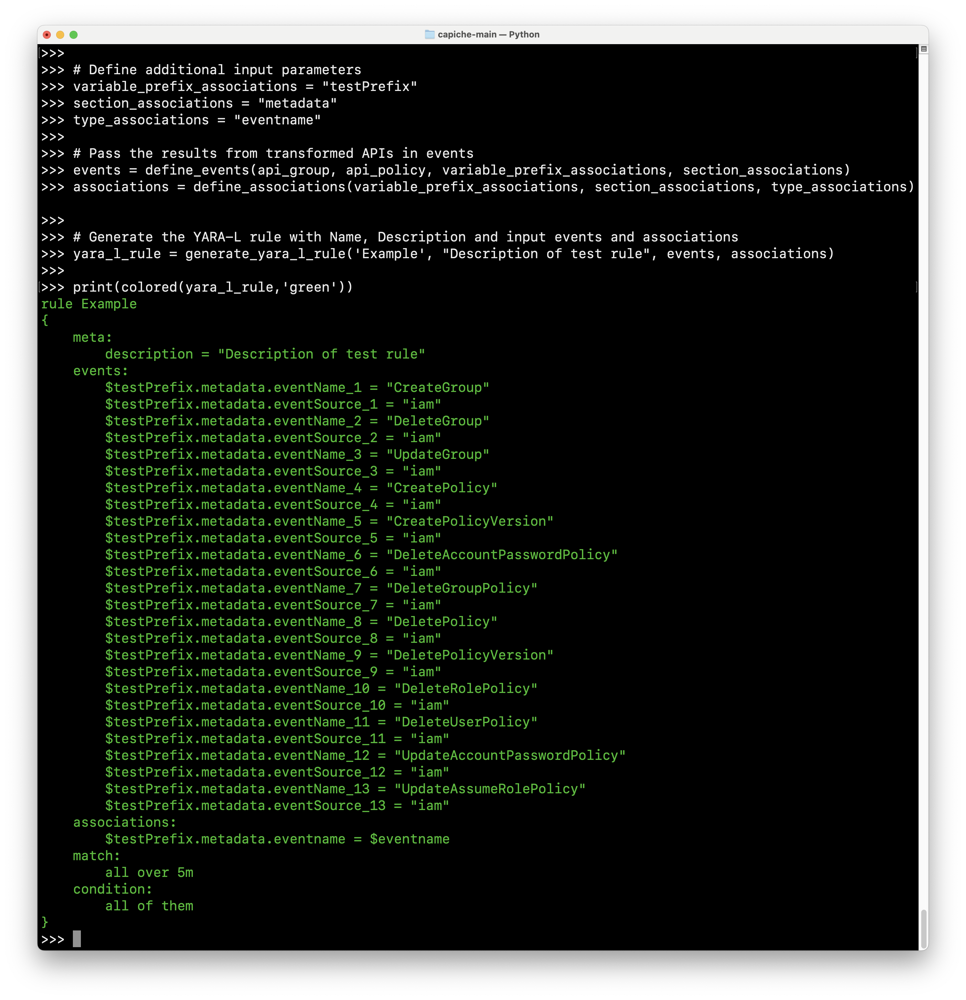
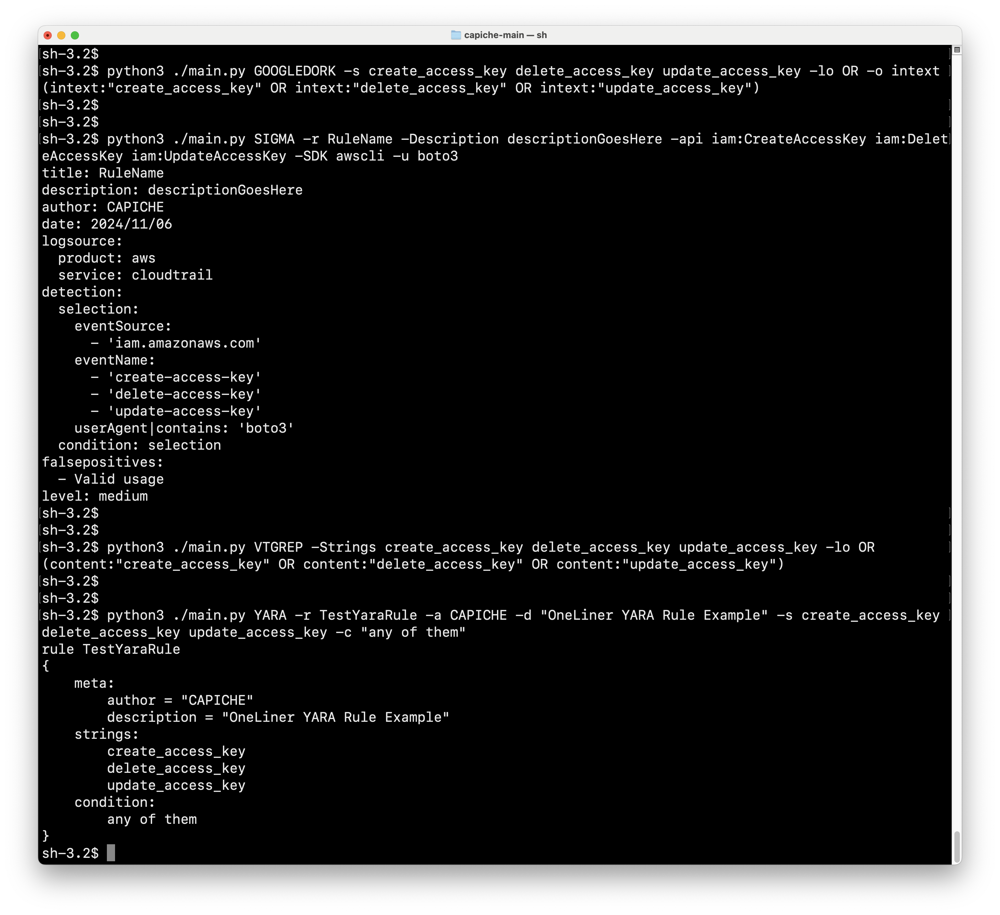

# CAPICHE Detection Framework

**Permiso:** [https://permiso.io](https://permiso.io/)

**Read our release blog:** https://permiso.io/blog/introducing-open-source-tool-capiche

**Release Date: November 2nd, 2024**

**Event: BSides Chicago**

## Introduction

**CAPICHE Detection Framework (Cloud API Conversion Helper Express)** is an open-source tool designed to simplify each step of the cloud API detection translation pipeline, enabling any defender to instantly create numerous styles of detection rules from groupings of APIs. With this framework defenders can dynamically assemble multiple sets of cloud APIs, translate these API names into their SDK-specific counterparts and then generate any number of final detection rule formats.

A small example is shown below:


## Key Features
- **Cloud Related:** Compatible with AWS cloud provider.
- **Development:** Created in Python programming language and easy to use.
- **Usability:** Easy to use regular expressions for searching APIs based on name or description.
- **Detection:** Different styles of detection rule formats from groupings of APIs.
- **Final Formats:** YARA, YARA-L, Sigma, VirusTotal VTGrep content searching and Google Dorking.

## Tool Structure

- **./core/helper/search.py:** This script provides functionality to search for APIs by name or description within the API data.
- **./core/helper/transform.py:** This script transforms API lists based on the provided SDK type (boto or awscli). It reads the API data from the loaded JSON file and transforms the user's input API names accordingly.
- **./core/helper/yarastringgen.py:** This script generates YARA strings based on the transformed API lists. It includes options to add variable prefix, modifiers, comments and API descriptions.
- **./core/detection/yara.py:** This script generates a complete YARA rule using the provided YARA strings, rule name, author, description and condition.
- **./core/detection/yaral.py:** This script generates YARA-L rules for input list of APIs.
- **./core/detection/sigma.py:** This script generates Sigma rules for input list of APIs.
- **./core/detection/googledork.py:** This script generates Google Dork rules for input list of APIs.
- **./core/detection/vtgrep.py:** This script generates VirusTotal VTGrep rules for input list of APIs.
- **./core/api_list_aws.json:** This is a JSON file containing the full list of AWS API data (API names and descriptions) for searchability functions.

## Prerequisites

>```bash
># Set up a virtual environment
>python3 -m venv ./venv
>source venv/bin/activate
>
># Install required dependencies
>python3 -m pip install -r requirements.txt
>```

## Running CAPICHE 
CAPICHE is best run as individual modules, so we recommend running `python` or `python3` and entering into an interactive REPL (Read-Eval-Print Loop) session and importing select functions as shown below:

### General Imports:
```python
# Import all functions
from core.helper.transform import load_api_data, transform_api_list
from core.helper.search import search_api_name, search_api_description
from core.helper.yarastringgen import generate_yara_string
from core.detection.yara import generate_yara_rule
from core.detection.sigma import generate_sigma_rule
from core.detection.vtgrep import generate_vtgrep_content
from core.detection.googledork import generate_google_dork_syntax
from core.detection.yaral import generate_yara_l_rule, define_events, define_associations

# Optionally import some colors to brighten your day when running these demo commands :)
from termcolor import colored

# Import JSON list of all AWS API names and descriptions
api_data = load_api_data('./core/api_list_aws.json')
```

### Generate Transformed API Lists
```python
# First let's dynamically build two lists of APIs based on regex searches against the AWS API names and descriptions.
# Then we will transfrom these lists based on select SDKs to be used as input in remainder of examples.

# Search for different patterns for API name
api_group = search_api_name(api_data, '^(iam|sso):(Create|Delete|Update)Group$')

# Search for different patterns for API description
api_policy = search_api_description(api_data, '^(Create|Update|Delete).*Policy', 'iam|sso')

# Specify the SDK and pass the results from search functions to transform the APIs
api_group_boto = transform_api_list(api_data, "boto", api_group)
api_group_awscli = transform_api_list(api_data, "awscli", api_group)
api_policy_boto = transform_api_list(api_data, "boto", api_policy)
api_policy_awscli = transform_api_list(api_data, "awscli", api_policy)
```

### Generating YARA Rules:
```python
# Create strings with transformed APIs and put Variable Prefix, Modifier, Comment, and the Description should be on True to show description for each API
yara_strings_group = generate_yara_string(api_data, api_group_boto + api_group_awscli, "group", "wide ascii", "group", True)
yara_strings_policy = generate_yara_string(api_data, api_policy_boto + api_policy_awscli, "policy", "wide ascii", "policy", False)

# Generate the final YARA rule with Name, Author, Description, pass the transformed strings, Condition and some additional content for metadata
final_yara_rule = generate_yara_rule("GroupAndPolicyRule", "CAPICHE", "Demo YARA rule", yara_strings_group + yara_strings_policy, "((any of $group*) and (any of $policy*))", [{"MD5": "1234567890"}])

print(colored(final_yara_rule,'green'))
```


### Generating VTGrep Rules:
```python
# Generate the VTGrep content with some extra Header, Logical Operators and content from transformed strings
vt_syntax = generate_vtgrep_content("import boto3") + " AND (" + generate_vtgrep_content(api_group_boto, "OR") + " AND " + generate_vtgrep_content(api_policy_boto, "OR") + ")"

print(colored(vt_syntax,'green'))
```


### Generating Google Dorking Rules:
```python
# Generate the Google Dorking syntax while passing the transformed strings, Logical Operator and Modifier
google_dork_syntax = 'intext="import boto3" AND ' + generate_google_dork_syntax(api_group_boto, "OR", "intext") + " AND " + generate_google_dork_syntax(api_policy_boto, "OR", "intext")

print(colored(google_dork_syntax,'green'))
```


### Generating Sigma Rules:
```python
# Generate the Sigma rule with a Name, Description, passing the content from JSON file, results from search functions, specify the SDK, specify what userAgent should contain
sigma_rule = generate_sigma_rule("test","testing comment", api_data, api_group + api_policy,"boto", "Boto3")

print(colored(sigma_rule,'green'))
```


### Generating YARA-L Rules:
```python
# Define additional input parameters
variable_prefix_associations = "testPrefix"
section_associations = "metadata"
type_associations = "eventname"

# Pass the results from transformed APIs in events
events = define_events(api_group + api_policy, variable_prefix_associations, section_associations)
associations = define_associations(variable_prefix_associations, section_associations, type_associations)

# Generate the YARA-L rule with Name, Description and input events and associations
yara_l_rule = generate_yara_l_rule('Example', "Description of test rule", events, associations)

print(colored(yara_l_rule,'green'))
```


### Non-Interactive Mode:
```python
# Non-interactive one-liner generation of Google Dork rule
python3 ./main.py GOOGLEDORK -s create_access_key delete_access_key update_access_key -lo OR -o intext

# Non-interactive one-liner generation of Sigma rule
python3 ./main.py SIGMA -r RuleName -Description descriptionGoesHere -api iam:CreateAccessKey iam:DeleteAccessKey iam:UpdateAccessKey -SDK awscli -u boto3

# Non-interactive one-liner generation of VirusTotal VTGrep rule
python3 ./main.py VTGREP -Strings create_access_key delete_access_key update_access_key -lo OR

# Non-interactive one-liner generation of YARA rule
python3 ./main.py YARA -r TestYaraRule -a CAPICHE -d "OneLiner YARA Rule Example" -s create_access_key delete_access_key update_access_key -c "any of them"
```


### Notes
- Search functions support regular expressions against the API description or the combined EventSource:EventName syntax (e.g. `iam:CreateAccessKey`).
- The currently supported SDK specifications are `boto` and `awscli`.
- This release version contains only the AWS APIs.

## Contributing
Contributions are welcome!
Feel free to reach out for any questions or feedback.